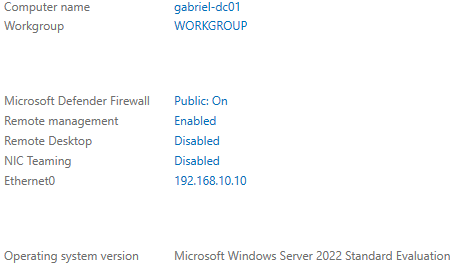

# Initial Server Configuration

## Hostname Configuration

The default Windows Server hostname was changed to `gabriel-dc01` to improve system identification and align with enterprise naming conventions.

A reboot was required after applying the hostname change.

---
## Static IPv4 Configuration

A static IPv4 address was configured to ensure consistent network identification and reliable Active Directory functionality.

### Network Settings

| Setting | Value |
|---|---|
| IP Address | 192.168.10.10 |
| Subnet Mask | 255.255.255.0 |
| Default Gateway | 192.168.10.1 |
| Preferred DNS Server | 127.0.0.1 |

The DNS server was configured to use the local loopback address in preparation for Active Directory Domain Services (AD DS) deployment.

---
