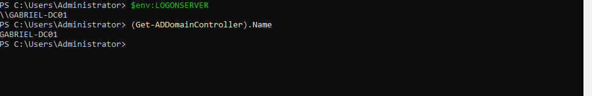
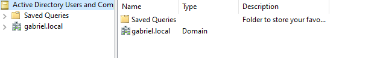

# Active Directory Domain Services Deployment

## Objective

The objective of this phase is to deploy Active Directory Domain Services (AD DS) and promote the Windows Server 2022 machine to a Domain Controller for the `gabriel.local` domain.

---

## Installed Roles

| Role | Purpose |
|---|---|
| Active Directory Domain Services | Centralized identity and authentication management |
| DNS Server | Internal name resolution for the domain |

---

## AD DS Installation

### PowerShell Command

```powershell
Install-WindowsFeature -Name AD-Domain-Services -IncludeManagementTools
```

### Purpose

This command installs the Active Directory Domain Services role along with the required administrative management tools.

---

## Domain Controller Promotion

### PowerShell Command

```powershell
Install-ADDSForest `
-DomainName "gabriel.local" `
-CreateDnsDelegation:$false `
-DatabasePath "C:\Windows\NTDS" `
-LogPath "C:\Windows\NTDS" `
-SysvolPath "C:\Windows\SYSVOL" `
-Force:$true
```

### Purpose

This command creates a new Active Directory forest and promotes the server to a Domain Controller for the `gabriel.local` domain.

---

## DSRM Password

A Directory Services Restore Mode (DSRM) password was configured during the promotion process.

The password is stored securely in a private password manager and is not included in this repository.

---

## Expected Result

After the installation process:
- The server automatically reboots
- Active Directory services become available
- DNS is configured locally
- The server operates as the first Domain Controller of the environment.


---

## Domain Controller Verification

The following commands were executed to verify that the server was successfully promoted to a Domain Controller.

### Verify Logon Server

```powershell
$env:LOGONSERVER
```

### Verify Domain Controller Name

```powershell
(Get-ADDomainController).Name
```

### Result

The commands confirmed that the server is operating correctly as the Domain Controller for the `gabriel.local` environment.



---

## Active Directory Management Console

The Active Directory Users and Computers management console was successfully initialized after the Domain Controller promotion process.



---

## Post-Deployment Validation

The following components were successfully validated after the Domain Controller deployment:

- Active Directory Domain Services (AD DS)
- DNS Server role
- Domain Controller promotion
- Active Directory management console access
- Internal domain authentication
- Static IPv4 configuration
- Local DNS resolution.
