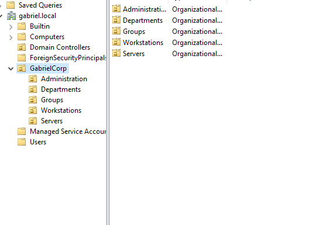

---

## Active Directory Environment Structure

### Organizational Unit (OU) Architecture
To mirror an enterprise production environment and prepare the infrastructure for granular Group Policy Objects (GPOs), a dedicated OU hierarchy was deployed under the corporate root. This avoids the utilization of default containers (such as `Users` or `Computers`) for production objects, establishing strict administrative boundaries and enabling Role-Based Access Control (RBAC).

The directory hierarchy is structured as follows:

- **GabrielCorp (Root OU)**
  - 📁 **Administration**: Dedicated to IT personnel and tier-structured administrative accounts.
  - 📁 **Departments**: Houses standard corporate user accounts partitioned by business units.
  - 📁 **Groups**: Centralized container for all Security and Distribution Groups.
  - 📁 **Workstations**: Standardized container for domain-joined client endpoints.
  - 📁 **Servers**: Target container for member servers and infrastructure assets.

### OU Architecture Verification
The following screenshot verifies the successful creation and structural hierarchy of the Organizational Units within the `gabriel.local` domain:

