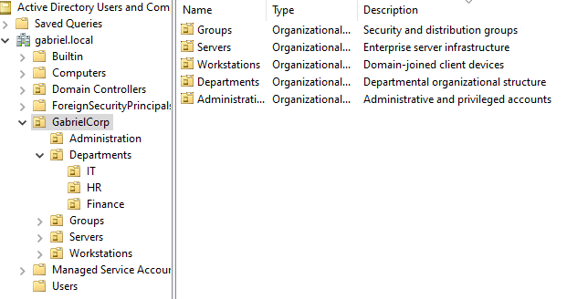
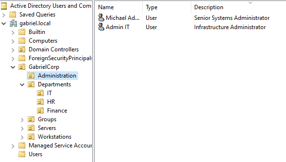
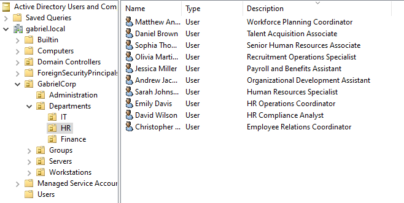
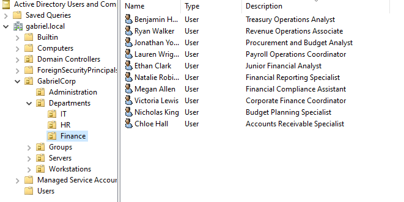

## Active Directory Environment Structure

### Organizational Unit (OU) Architecture
To simulate a structured enterprise Active Directory environment and prepare the domain for future Group Policy Object (GPO) configurations, a dedicated OU hierarchy was deployed under the corporate root.

This avoids the use of default containers (such as Users or Computers) for production objects, enabling better administrative organization and simplified access management.

The directory hierarchy is structured as follows:

- **GabrielCorp (Root OU)**
  - 📁 **Administration**: Dedicated to IT personnel and tier-structured administrative accounts.
  - 📁 **Departments**: Houses standard corporate user accounts partitioned by business units.
  - 📁 **Groups**: Centralized container for all Security and Distribution Groups.
  - 📁 **Workstations**: Standardized container for domain-joined client endpoints.
  - 📁 **Servers**: Target container for member servers and infrastructure assets.

## Technical Deployment & Verification Evidence
The following screenshot verifies the successful creation, structural hierarchy, and metadata/description enforcement of the Organizational Units within the `gabriel.local` domain:

### Administrative Accounts
Dedicated administrative accounts were created within the Administration OU to separate privileged infrastructure management tasks from standard domain user operations.

### HR Department User Structure
User accounts were deployed under the dedicated Departments/HR OU using standardized naming conventions and role-based account descriptions.

### Finance Department User Structure
Finance department accounts were organized to simulate a structured corporate environment and prepare the domain for future access-control configurations.

---
## Identity Management & Directory Hardening Overview

The implemented Identity and Access Management (IAM) structure provides strict logical separation between administrative roles, departmental users, and functional assets. 

### Applied Directory Security Controls:
* **Privilege Separation (Tiered Administration)**: Administrative identities (`admin.it`) are decoupled from standard user activities, mitigating horizontal privilege escalation risks.
* **Identity Standardization**: All 24 provisioned accounts enforce mandatory corporate metadata parameters (`Description` and `Department` attributes) to comply with internal identity auditing standards.
* **Organizational Structure Preparation**: The HR and Finance organizational structures prepare the environment for future Group Policy Object (GPO) configurations, auditing policies, and access-control management.