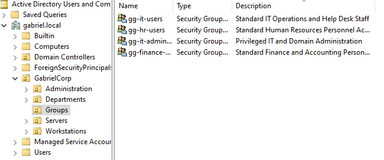
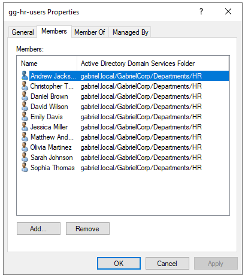

# Role-Based Access Control (RBAC) - Security Groups Implementation

## 1. Security Group Architecture
To establish a scalable security model and implement effective Role-Based Access Control (RBAC), user permissions are managed through dedicated security groups rather than individual accounts.

This architecture ensures that future authorization policies, resource access lists (ACLs), and Group Policy Objects (GPOs) target security groups instead of individual user accounts, minimizing administrative overhead and reducing the risk of permission creep.

The security groups are deployed under the isolated `GabrielCorp/Groups` organizational boundary:

| Group Name | Scope / Type | Target OU Path | Operational Purpose | Assigned Members |
|---|---|---|---|---|
| `gg-it-administrators` | Global / Security | `GabrielCorp/Groups` | Privileged IT and Domain Administration | 2 Administrative Accounts |
| `gg-it-users` | Global / Security | `GabrielCorp/Groups` | Standard IT Operations and Help Desk Staff | 2 Standard IT Accounts |
| `gg-hr-users` | Global / Security | `GabrielCorp/Groups` | Standard Human Resources Personnel Access Control | 10 Standard HR Accounts |
| `gg-finance-users` | Global / Security | `GabrielCorp/Groups` | Standard Finance and Accounting Personnel Access Control | 10 Standard Finance Accounts |

---

## 2. Technical Deployment & Membership Verification

### Group Architecture View
The following screenshot verifies the successful creation of the structural security groups, along with their standardized naming conventions and operational descriptions within the domain:

### Group Membership Audit Sample
To validate bulk provisioning and proper group assignment, the following evidence shows a representative audit sample of the internal accounts assigned to the departmental security groups:

---

## 3. Access Control & RBAC Overview

The deployment of these security containers establishes the logical groundwork for infrastructure hardening and network resource restriction.

### Applied Administration Principles:
* **Simplified Permissions Management**: Access to shared folders, network assets, and local resources will be granted exclusively to groups, never to individual users.
* **Separation of Operational Duties**: Privileged administrators (`gg-it-administrators`) are isolated from departmental users, preventing standard service accounts from gaining unauthorized vertical access.
* **Scalable User Administration**: When onboarding new corporate staff, assigning the user to their corresponding department OU and global group automatically inherits the entire baseline security posture of that business unit.